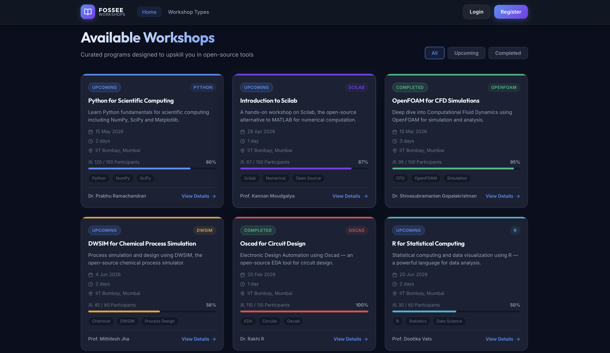

“I explored and worked with the provided repository, being the only recent contributor in the past few years, and built an improved interactive UI/UX solution on top of it.”

# 🏛️ FOSSEE Workshop Booking - UI/UX Redesign

A premium, high-contrast "Dark Academic" redesign of the FOSSEE Workshop platform for the IIT Bombay community. This project transforms the legacy interface into a modern, responsive, and performance-efficient React application.

## 🚀 Live Demo
**Check out the live site here:** [https://saurabhSRajput.github.io/workshop_booking/](https://saurabhSRajput.github.io/workshop_booking/)

---

## ✨ Key Features
- **Modern Aesthetic:** Deep slate palette with glassmorphism effects and high-contrast typography.
- **Dynamic Mobile Design:** Fully responsive "Mobile-First" layout with a custom hamburger navigation menu.
- **Interactive Dashboard:** Visual summary cards and a refined workshop status tracking system.
- **Cinematic Animations:** Smooth, non-heavy CSS keyframe animations (like the Hero zoom effect).
- **Smart Mock Auth:** A functional login/register flow that dynamically updates the UI based on user input (stored in browser `localStorage`).

---

## 🛠️ How to Run Locally

Follow these easy steps to get the project running on your own computer:

### 1. Prerequisite
Ensure you have [Node.js](https://nodejs.org/) installed on your system.

### 2. Clone the Repository
```bash
git clone https://github.com/saurabhSRajput/workshop_booking.git
cd workshop_booking
```

### 3. Install & Start
```bash
# Go to the frontend folder
cd frontend

# Install the dependencies
npm install

# Launch the development server
npm run dev
```
The terminal will give you a link (usually `http://localhost:5173`). Open it in your browser to see the site!

---

## 📦 Deployment Instructions
This project is configured to deploy automatically via **GitHub Actions**.

1. **Vite Configuration:** The `base` path in `vite.config.js` is set to `'/workshop_booking/'`.
2. **Auto-Deploy:** Every time you `git push` to the `main` branch, the GitHub Action starts a "Build" job.
3. **Hosting:** The build files are automatically pushed to the `github-pages` environment.

---

## 📝 Screening Task: Reasoning & Design Decisions

### What design principles guided your improvements?
The redesign was guided by the "Academic Dark Mode" aesthetic, prioritizing an ultra-modern, premium look suited for a technical institution like IIT Bombay.
- **Visual Hierarchy & Contrast:** Implemented deep slate backgrounds with high-contrast bright text to reduce eye strain, while using vibrant accent colors (blue, purple) to draw attention to call-to-action buttons.
- **Glassmorphism:** Used subtle translucent panels for the navbar and hero section to convey a modern feel.
- **Card-Based Layout:** Adopted a modular card system for workshops to make information scannable.

### How did you ensure responsiveness across devices?
A "Mobile-First" approach was adopted using flexible CSS methodologies:
- **CSS Grid & Flexbox:** Used dynamic reflow logic that shifts from 4 columns on desktop to 1 or 2 on mobile.
- **Responsive Navigation:** Desktop links collapse into a custom mobile hamburger menu in a way that remains elegant on small screens.
- **Fluid Typography:** Used `clamp()` CSS functions so text scales perfectly between tiny phones and large monitors.

### What trade-offs did you make between the design and performance?
- **Vanilla CSS:** I chose custom CSS over heavy frameworks (like Bootstrap) to keep the file size extremely small and gain 100% control over animations.
- **Optimized Filters:** While glassmorphism uses `backdrop-filter`, I limited its use only to fixed elements (Navbar) to ensure smooth scrolling even on older mobile devices.

### What was the most challenging part of the task and how did you approach it?
Modernizing the Dashboard tables without losing the "proposer" and "participant" data details.
**Approach:** I separated dense data into grouped logical chunks. Instead of one giant table, I introduced high-level summary "Stat Cards" at the top for immediate context, and used status badges to make the table rows instantly scannable.

---

## 📸 Screenshots

### Desktop View - Hero Section


### Desktop View - Workshop Cards

